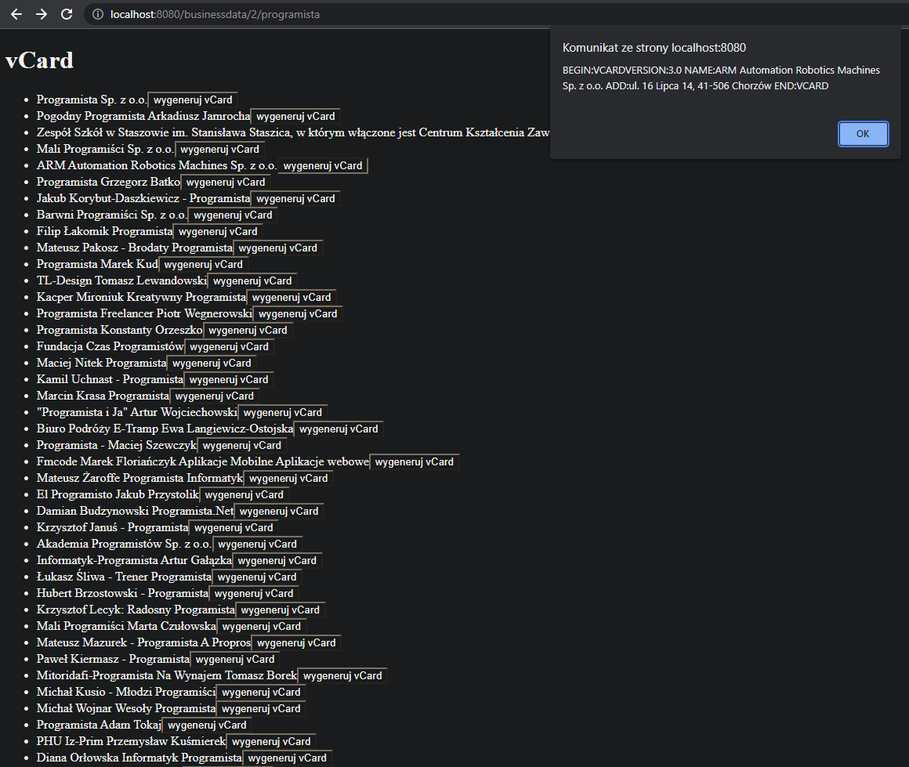

# PPKWUzad5 - Mobilny vCard

Zadaniem API jest wygenerowanie plików vcf dla wybranych firm. 
Api korzysta ze strony ```https://panoramafirm.pl/```.
Aplikacja stworzona jest za pomocą Springa wykorzustując Spring Web. Uruchamiana domyślnie ```http://localhost:8080/```.
Aplikacja odpalana jest funkcją main zawartą klasie Ppkwuzad5Application. Projekt zawiera klasę ```ApivCardController``` zawierającą endpoint ```getBusinessData``` .


# Analizowanie danych firm
Endpoint ```ApivCardController``` generuje stronę z listą specjalistów w danej dziedzinie. Dla każdej firmy jest przycisk, który generuje dane o firmie.

Opis:
```businessdata/{pageamount}/{businesstype}```

gdzie: 
```pageamount``` - to ilość stron z których ma być generowany dokument.````businesstype```` - typ firmy.

Błędne dane spowodują zwrócenie wiadomości o błędzie.

Przykład:
```http://localhost:8080/businessdata/3/programista ```




